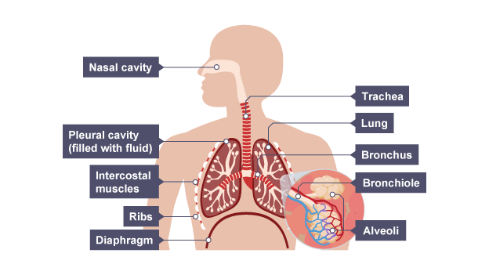
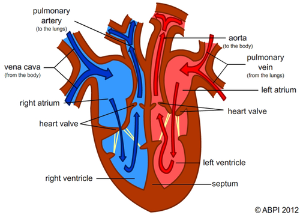
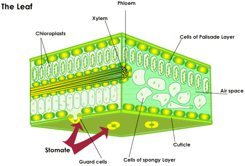
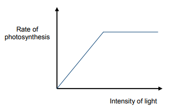
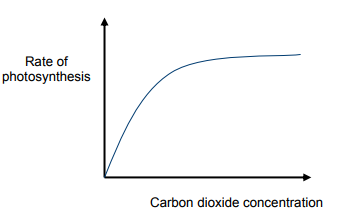
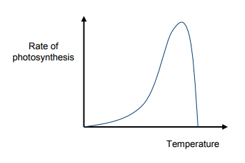

##### Checklist
- [x] Cell biology
- [x] organisation
- [x] Infection and response
- [ ] Bioenergetics
- [ ] Homeostasis and response
- [ ] Inheritance, variation and evolution
- [ ] Ecology

# Biology

<!-- @import "[TOC]" {cmd="toc" depthFrom=1 depthTo=4 orderedList=false} -->
<!-- code_chunk_output -->

* [Biology](#biology)
	* [Cell Biology](#cell-biology)
		* [Cell Structure](#cell-structure)
			* [Eukaryotes and Prokaryotes](#eukaryotes-and-prokaryotes)
			* [Subcellular Structures](#subcellular-structures)
			* [Typical Animal, Plant and Bacteria Cells](#typical-animal-plant-and-bacteria-cells)
			* [Examples of Specialised Cells](#examples-of-specialised-cells)
			* [Microscopy](#microscopy)
			* [**Required Practical 1: Using a light microscope to observe animal and plant cells**](#required-practical-1-using-a-light-microscope-to-observe-animal-and-plant-cells)
			* [Stem Cells & Differentiation](#stem-cells-differentiation)
		* [Cell Division](#cell-division)
			* [Growth and DNA Replication & Mitosis](#growth-and-dna-replication-mitosis)
			* [Meosis](#meosis)
			* [Binary Fission](#binary-fission)
			* [**Required Practical 2: Culturing Microorganisms**](#required-practical-2-culturing-microorganisms)
		* [Transport in Cells](#transport-in-cells)
			* [Diffusion, Osmosis and Active Transport](#diffusion-osmosis-and-active-transport)
			* [Comparing water concentrations and their effects](#comparing-water-concentrations-and-their-effects)
			* [**Required Practical 3: Investigating effect of sugar solution on plant tissue**](#required-practical-3-investigating-effect-of-sugar-solution-on-plant-tissue)
			* [Exchange Surfaces](#exchange-surfaces)
			* [Factors that affect rate of Diffusion](#factors-that-affect-rate-of-diffusion)
	* [Organisation](#organisation)
		* [Enzymes](#enzymes)
		* [**Required Practical 4: Food Tests**](#required-practical-4-food-tests)
		* [Animals](#animals)
		* [Digestive System](#digestive-system)
			* [**Required Practical 5: Investigate the effect of pH on the rate of reaction of amylase**](#required-practical-5-investigate-the-effect-of-ph-on-the-rate-of-reaction-of-amylase)
			* [Lungs](#lungs)
			* [Circulatory System](#circulatory-system)
			* [Cardiovascular Disease](#cardiovascular-disease)
			* [Health](#health)
			* [Cancer](#cancer)
		* [Plants](#plants)
			* [Leaf](#leaf)
			* [Transpiration and Translocation](#transpiration-and-translocation)
	* [Infection and response](#infection-and-response)
		* [Examples of Communicable diseases](#examples-of-communicable-diseases)
			* [Reducing/Preventing spread of diseases](#reducingpreventing-spread-of-diseases)
		* [Types of Pathogens](#types-of-pathogens)
		* [Human Defence Systems](#human-defence-systems)
			* [First line of Defence](#first-line-of-defence)
			* [Second line of Defence](#second-line-of-defence)
			* [Third line of Defence](#third-line-of-defence)
		* [Plants](#plants-1)
			* [Plant defences](#plant-defences)
		* [Vaccination](#vaccination)
		* [Antibiotics and Painkillers](#antibiotics-and-painkillers)
		* [Monoclonal Antibodies](#monoclonal-antibodies)
			* [Uses of Monoclonal Antibodies](#uses-of-monoclonal-antibodies)
	* [Bioenergetics](#bioenergetics)
		* [Photosynthesis](#photosynthesis)
			* [**Required Practical 6: Investigating effect of light intensity on the rate of photosynthesis using pond weed**](#required-practical-6-investigating-effect-of-light-intensity-on-the-rate-of-photosynthesis-using-pond-weed)

<!-- /code_chunk_output -->

## Cell Biology
The **cell** is the fundamental unit of living organisms.
### Cell Structure

An **organelle** is a specific part of a cell that performs a specific function.

#### Eukaryotes and Prokaryotes
| Eukaryote                | Prokaryote                       |
| ------------------------ | -------------------------------- |
| Animal, Plant            | Bacteria                         |
| Bigger                   | Smaller                          |
| More Complex             | Simpler                          |
| DNA contained in nucleus | DNA freely floating in cytoplasm |
| Multicellular            | Unicellular                      |

Prokaryotes do not have organelles whilst eukaryotes do.

Prokaryotes are believed to have developed 3.5 billion years ago, before eukaryotes. This is because prokaryotes are smaller, they do not have complex organelles and are able to survive and reproduce as a single cell.

#### Subcellular Structures
| Component                              | Function                                 |
| -------------------------------------- | ---------------------------------------- |
| Cytoplasm                              | Gel-like substance where most of the chemical reactions occur. |
| Cell Membrane                          | Selectively permeable membrane that controls the exchange of substances in and out of the cell. |
| Ribosomes                              | Site of Biological Protein Synthesis (link amino acids together in order specified by mRNA) |
| Mitochondria*                          | Organelle where most of the reactions for aerobic respiration occur (produces ATP which is used as energy for the cell). Contains enzymes that control these reactions. |
| Nucleus*                               | Membrane-enclosed organelle which contains DNA arranged in chromosomes which controls the activities of the cell. |
| Chloroplast**                          | Organelle where photosynthesis occurs which provides glucose. Conbtains chlorophyll pigment which absorbs light for photosynthesis. |
| Permanent Vacuole**                    | Contains cell sap; a solution of dissolved sugars and mineral ions in water. Maintains turgor pressure by pressing the cytoplasm against the cell wall. |
| Cell Wall^ **                          | Provides structural support and protection. Prevents over-expansion of the cell when water enters. |
| Plasmids^                              | Small circular section of DNA that provides [genetic variation.](#binary-fission) |
| Freely Floating DNA loop in Cytoplasm^ | Controls activities of the cell          |
| Flagellum^                             | A rotary motor which provides movement   |
| Slime Capsule^                         | Provides further protection against environmental dangers (e.g. antibiotics) |

_Eukaryotic cells*_
_Plant cells**_
_Prokaryotic cells^_

#### Typical Animal, Plant and Bacteria Cells
| Plant                                    | Animal                                   | Bacteria                                 |
| ---------------------------------------- | ---------------------------------------- | ---------------------------------------- |
| <ul><li>Cytoplasm</li><li>Cell Membrane</li><li>Ribosomes</li></ul> | <ul><li>Cytoplasm</li><li>Cell Membrane</li><li>Ribosomes</li></ul> | <ul><li>Cytoplasm</li><li>Cell Membrane</li><li>Ribosomes</li></ul> |
| _<ul><li>Mitochondria</li><li>Nucleus</li></ul>_ | _<ul><li>Mitochondria</li><li>Nucleus</li></ul>_ | **<ul><li>Plasmids</li><li>DNA loop in Cytoplasm</li></ul>** |
|                                       | **<ul><li>Chloroplast</li><li>Permanent Vacuole</li><li>Cell Wall</li></ul>** | **<ul><li>Flagellum</li><li>Slime Capsule</li><li>Cell Wall</li></ul>** |
| 20-100μm                                 | 10-30μm                                  | 1-10μm (size)                            |

This makes me think of runescape? Why? Because everything makes me think of runescape. Except from everything that makes me think of finance.

##### Differences in subcellular structures
| Component | Animal      | Plant             | Bacteria       |
| --------- | ----------- | ----------------- | -------------- |
| Cell Wall |          | Made of Cellulose | Made of Murein |
| Ribosomes | L A R G E R | L A R G E R       | S M A L L E R  |
#### Examples of Specialised Cells

| Specialised Cell | Diagram                                  | Function                                 | Adaptations                              |
| ---------------- | ---------------------------------------- | ---------------------------------------- | ---------------------------------------- |
| Sperm Cell       |  | To transport male DNA to female DNA for sexual reproduction. | <ul><li>Tail to provide movement</li><li>Large number of mitochondria to provide more energy for movement</li><li>Large number of mitochondria to provide more energy for movement</li><li>Contains half the DNA of a typical cell since other half of DNA is provided for by female gamete.</li></ul> |
| Nerve Cell       |                                          | To transport information as electrical impulses from one part of the body to another in order to coordinate actions | <ul><li>Long to reduce the number of synapses to increase the speed.</li><li>branched connections at either ends to be able to connect to other nerve cells in order to form a network.</li><li>Axon surrounded by myelin sheath to insulate the electrical signal</li></ul> |
| Muscle Cell      |                                          | To contract and relax to provide movement | <ul><li>Long to provide enough space for contraction.</li><li>Contain a lot of mitochondria to provide energy needed for contraction.</li></ul> |
| Root Hair Cell   |                                          | To absorb water and mineral ions         | <ul><li>Long "hair" extensions which provide greater surface area</li></ul> |
| Phloem Cell      |                                          | Transport `dissolved sugars` made in `leaves` to `rest of plant` in **translocation** process | <ul><li>Made of `elongated living cells` with `small pores in the end walls` to allow `cell sap` to flow through.</li><li>Transport substances in `both directions`</li></ul> |
| Xylem Cell       |                                          | To transport `water and mineral ions` from the `roots` to the `stem and leaves` in **transpiration stream** | <ul><li>Made of `dead cells joined end to end` with `no end walls` between them and a hole down the middle</li><li>Dead cells are strengthened by a lignin substance.</li></ul> |
| Guard Cell       |                                          | Open and close stomata to control gas exchange and amount of water lost in the leaves | <ul><li>become turgid when plant has a lot of water which causes stomata to open.</li><li>become flaccid when plant has a shortage of water causing stomata to close</li><li>thin outer walls and thick inner walls</li><li>sensitive to light and close at night to conserve water</li></ul> |

#### Microscopy
**Light Microscopes** use light and lenses to focus and magnify an image.

Magnification is the ratio of how much bigger you made something from its original size:

$$magnification = \frac{\text{image size}}{\text{actual size}}$$

$$\text{total magnification of light microscope = magnification of eyepiece lens} \times \text{magnification of objective lens}$$

An **electron microscope** uses electrons to focus and magnify an image.

#####Comparison of Light And Electron Microscopes

There are 2 types of electron microscopes; **Transmission Electron Microscopes** and **Scanning Electron Microscopes**.

| Difference          | SEM            | TEM            |
| ------------------- | -------------- | -------------- |
| Dimension           | 3D             | 2D             |
| How image is formed | Beam Formation | Direct Imaging |
| Magnification       | x2,000,000     | x50,000,000    |
| Resolution          | 0.4nm          | 0.5 Angstroms  |
| Scanning            | Larger areas   | Thin samples   |
| Invented            | 1931           | 1937           |

| Difference                         | Light          | Electron                 |
| ---------------------------------- | -------------- | ------------------------ |
| Image formed                       | colour         | grey scale               |
| resolution & magnification         | much less      | much greater             |
| Price                              | Very Cheap     | Very Expensive           |
| Size                               | Portable       | Massive (Whole room)     |
| Preparation of Specimen            | Quick & Simple | Time-consuming & complex |
| Does the Specimen have to be dead? | No             | Yes                      |

Electron microscopes require professional training in order to use them due to their cost and the difficulty in using them.
#### **Required Practical 1: Using a light microscope to observe animal and plant cells**
**Stains** such as iodine solution are used to highlight objects in in a cell by adding colour to them. This helps to see large subcellular structures.
##### Preparing a slide with plant cells (onion)
1. Wearing eye protection, use `tweezers` to remove a thin sheet of epidermal tissue from the inner part of an onion layer.
2. Place the epidermal tissue on a microscope slide.
3. Add `iodine solution (stain)`
4. Place a cover slip on top. Try to ensure you do not get any air bubbles.
##### Preparing a slide with animal cells (human cheek)
1. Wearing eye protection, using an `interdental stick or flossing brush` gently scrape inside of your cheek.
2. Smear the cotton swab on the centre of the microscope slide in small circles.
3. Add drop of `methylene blue solution` (irritant and harmful, avoid skin contact and wear glasses)
4. Place a cover slip on top. Try to ensure you do not get any air bubbles.
   _Put slides in a solution of 1% Virkon._ (After viewing)
##### Viewing and Examining a slide using a light microscope
1. Place a slide on the microscope stage
2. Focus in on the image by using the coarse and fine adjustment knobs/focuses then use the eyepiece lens to increase the magnification until you can clearly see the cell's structure.
3. Increase the magnification further using higher powered objective lenses if you want to see more detail.
4. Using pencil, make a clear drawing of the subcellular structures using a microscope. You can use a
#### Stem Cells & Differentiation
**Differentiation** is where a typical cell develops different subcellular structures in order to become a **specialised cell** that carries out a specific function. It occurs in Eukaryotes (Multicellular organisms).

A **stem cell** is an undifferentiated cell that has the ability to differentiate into a specialised cell.

**In Vitro Fertilisation (IVF)** is a medical procedure where ova are artificially fertilised outside of a woman's uterus, then placed inside her uterus to develop into a baby.

##### Comparison of Stem Cells in Plants and Animals
| Comparison                       | Plant                            | Animal                                   |
| -------------------------------- | -------------------------------- | ---------------------------------------- |
| When does differentiation occur? | Throughout the plant's lifespan. | Embryonic stem cells totipotent; Adult stem cells multipotent. Less differentiation occurs in adults and is meant for replacing and repairing old cells. |
| Where are stem cells located?    | Meristem                         | Everywhere in embryos; Bone marrow in adults. |
##### Bull shit ethics/Stem Cell Research
Scientists think that stem cells could one day be used to:
- treat paralysed patients by making new nerve cells to transplant into severed spinal cord or damaged brain
- treat conditions like diabetes by replacing cells in the body that are no longer functioning properly.
- replacing cells in the choroid of the eye so blind patients can see again.
- replace injured or defective organs.

Some religious fanatics disagree with stem cell research as they believe:
1. An embryo is a potential human life
2. And all life is sacred (Why dont they stop eating meat?)
3. So it is wrong to experiment on human stem cells
4. IVF is considered by many religions as immoral or unholy.
5. Some countries have banned stem cell research and it is only allowed to occur in the UK under strict guidelines.
### Cell Division
Half of the DNA in a human body cell came from your father, the other half from your mother.

Sex cells (Sperm, ova, pollen) are known as **gametes**. They have half the number of chromosomes of a typical body cell. This means they are **haploid gametes**.

There are 23 pairs of chromosomes in a body cell (46).

A **gene** is a region of DNA in a chromosome that contains instructions to make 1 protein.

Since you have a mother and father, you have two versions of the same gene which are called **alleles**.

#### Growth and DNA Replication & Mitosis
Diploid body cells in multicellular eukaryotes divide by mitosis.
This process is used to grow or replace cells that have been damaged (such as skin).

There are 2 main stages of the cell cycle:
1. Growth and DNA Replication
2. Mitosis

##### Growth and DNA Replication
1. the DNA is spread out in long strings
2. cell grows and increases number of subcellular structures
3. DNA is duplicated which forms X-shaped chromosomes. Each arm of the chromosome is an exact duplicate of the other arm.
  s
##### Mitosis
1. the chromosomes line up at the centre of the cell and cell fibres pull them apart. The 2 arms of each chromosome go to opposite ends of the cell.
2. Membranes form around each of the sets of chromosomes. These become nuclei of the 2 new cells - the nucleus has divided.
3. Cytoplasm and cell membrane divide.

After mitosis, **2 new identical daughter cells** have been produced. Their DNA is identical to the parent cell.

#### Meosis
Meosis is used to make haploid gametes which have half the number of chromosomes of a regular body cell. It occurs in the reproductive organs (testes, ovaries). It is a special case of mitosis that occurs in eukaryotes.

1. Chromosomes duplicated to form X-shaped Chromosomes (2 arms).
2. First Division: Chromosome pairs line up in centre of the cell and are pulled apart by cell fibres so each new cell only has one copy of each chromosome. Some of the fathers chromosomes and mothers chromosomes go into each new cell.
3. Second Division: Chromosomes line up in centre of the cell and arms of the chromosomes are pulled apart.

At the end, 4 new haploid gametes are formed. Each of the gametes is genetically different from the parent. This is because the chromosomes get shuffled up during each division and each new cell only gets half of the chromosomes (random as to which ones).
#### Binary Fission
Prokaryotic (bacteria) cells reproduce through binary fission.

1. The Plasmids and Circular DNA replicate
2. The Cell grows and Circular DNA strands move to opposite poles of the cell.
3. The cytoplasm begins to divide and new cell walls begin to form.
4. The cytoplasm divides completely and 2 new daughter cells are formed. They have the same circular DNA but have different numbers of Plasmids which provide genetic variation.

To calculate the number of bacteria cells in a colony:

(initial n) * 2^n of divisions = n of bacteria cells

n of divisions = total time elapsed / mean division time

E.coli take 20 minutes to if given optimum conditions.

##### Comparison of cell division methods
| Comparison             | Binary Fission                           | Mitosis                         | Meosis                        |
| ---------------------- | ---------------------------------------- | ------------------------------- | ----------------------------- |
| When is it used?       | Prokaryotic (bacteria) cells             | (Eukaryotic) typical body cells | (Eukaryotic)  haploid gametes |
| What is produced?      | 2 daughter cells.                        | 2 daughter cells.               | 4 haploid gametes             |
| Is DNA same as Parent? | Circular DNA same. Different number of plasmids | Identical                       | Different                     |
| How fast is it?        |                                          |                                 |                               |

#### **Required Practical 2: Culturing Microorganisms**
Bacteria (and some other microorganisms) are cultured in a **culture medium**, which contains the carbohydrates, minerals, proteins and vitamins required in order to provide optimum conditions for them to grow.

There are 2 types of culture media; **nutrient broth solution** or **solid agar jelly**.

At school, cultures of microorganisms are not kept above 25 Degrees Celsius because harmful pathogens are more likely to grow above this temperature as the rate of growth increases exponentially, which in turn increases the chance of a mutation occurring.
##### How to Prepare an Agar Plate:
1. Hot Agar Jelly poured into **Petri dish** (shallow, round plastic dish).
2. When Jelly's cooled and solidified, inoculating loops can be used to transfer microorganisms to the culture medium. Alternatively, a sterile dropping pipette and spreader can be used to get an even covering of bacteria. (Microorganisms then multiply)

##### Investigating the effect of Antibiotics on Bacterial Growth
1. Place paper discs soaked in different types (or concentrations) of antibiotics on an agar plate that has an even covering of bacteria. Leave some space between the discs.
2. The antibiotic should diffuse into the agar jelly. Antibiotic-resistant bacteria will continue to grow on the agar around the paper discs, but non-resistant strains will die. A clear area will be left where the bacteria have died - the inhibition zone.
3. Make sure you use a control. This is a paper disc that has not been soaked in an antibiotic, instead it is soaked in sterile water. This allows you to measure the effect of the antibiotic is not the effect of something else.
4. Leave plate for 48 hours at 25 Degrees Celsius
5. The greater the effectiveness of the antibiotic, the larger the inhibition zone of bacteria.

_This method can be used to measure the effect of antiseptics._
##### Avoiding Cultures being contaminated
Contamination by unwanted microorganisms will affect your results.
To Avoid this:

1. Petri dish and culture medium must be sterilised to kill any unwanted microorganisms.
2. An inoculating loop must be sterilised by passing it through a hot flame before using it to transfer bacteria onto the culture medium.
3. the lid of the Petri dish must be lightly sealed by tape, this is to stop microorganisms from the air getting in.
4. the Petri dish should be stored upside down - to stop drops of condensation falling onto the agar surface.
### Transport in Cells
#### Diffusion, Osmosis and Active Transport
| Comparison  | Diffusion                                | Osmosis                                  | Active Transport                         |
| ----------- | ---------------------------------------- | ---------------------------------------- | ---------------------------------------- |
| Definition: | the net movement of particles from a region of higher concentration to a region of lower concentration along a concentration gradient | the net movement of water molecules from a region of high water potential to a region of lower water potential through a partially permeable membrane and down a water potential gradient. | The movement of molecules from a region of low concentration to a region of higher concentration against a concentration gradient that requires energy and carrier proteins |

#### Comparing water concentrations and their effects
   | Hypotonic  | Isotonic  | Hypertonic  
--|---|---|--
Meaning  | Total molar concentration of all dissolved solutes is less than that of inside the cell / another solution  | Total molar concentration of dissolved solutes is the same inside and out of cell / between solutions  | Total molar concentration of all dissolved solutes is greater than inside the cell / another solution.  
Diagram  |   |   |  
Effect on Animal Cell  |   |   |  
Effect on Plant Cell  |   |   |  

#### **Required Practical 3: Investigating effect of sugar solution on plant tissue**
1. Label 6 boiling tubes 0.0 , 0.2 ... , 1.0
2. For each concentration from 0.0 add 5cm^3 more salt/sugar solution and 5 cm^3 less distilled water:

| Concentration (M) | Volume of 1 M salt or sugar solution (cm^3) | Volume of distilled water (cm^3) | Total Volume (cm^3) |
| ----------------- | ---------------------------------------- | -------------------------------- | ------------------- |
| 0.0               | 0                                        | 25                               | 25                  |
| 0.2               | 5                                        | 20                               | 25                  |
| 0.4               | 10                                       | 15                               | 25                  |
| 0.6               | 15                                       | 10                               | 25                  |
| 0.8               | 20                                       | 5                                | 25                  |
| 1.0               | 25                                       | 0                                | 25                  |

3. Using a chipper or corer, remove tissue from the middle of a potato and cut it into 6 equal 1cm-long pieces.
4. Pat the first tissue sample dry with a paper towel, then measure and record:

Concentration (M)  | Starting Mass (g)  | End Mass (g)  | Change in mass (g)  | Change in mass (%)  
--|---|---|---|--

5. Place a 1cm-long piece of potato in the tube labelled 0.0M and start the stopwatch.
6. Repeat this for the other 5 concentrations
7. After 30 minutes, remove the potato piece from the tube and dry it gently using a paper towel.
8. Record the end mass for the potato piece.
9. Repeat for the other concentrations after each one has been in the solution for 30 minutes.

#### Exchange Surfaces
##### Examples of Osmosis, Diffusion and Active transport

The size of many organisms is determined by the maximimum distance that substances can diffuse quickly.

A **capillary** is a tiny blood vessel in between arteries and veins that transports blood to tissues and organs.

**Alveoli** are tiny sacs found in lungs through which gas exchange between blood and air occur.

**Villi** are tiny projections that increase the surface area of the small intestine

| Example           | Type                        | Plant/Animal? | Diagram | Function                                 | Adaptations                              |
| ----------------- | --------------------------- | ------------- | ------- | ---------------------------------------- | ---------------------------------------- |
| Lungs             | Diffusion                   | Animal        |      | Provide oxygen to red blood cells and remove carbon dioxide via **ventilation** | <ul><li>moist, thin membranes that provide a short diffusion pathway</li><li>rich blood supply</li><li>Alveoli have a very large surface area to increase rate of diffusion</li></ul> |
| Small Intestines  | Diffusion, Active Transport | Animal        |      | Absorb nutrients from food into blood    | <ul><li>Have carrier proteins and available energy for active transport if nutrients need to be transported against the concentration gradient into the blood</li><li>Villi provide a large surface area</li><li>Villi have single layer of surface cells so short diffusion pathway.</li><li>A very good blood supply</li></ul> |
| Body Cells (Urea) | Diffusion                   | Animal        |      | Remove urea from cells into blood which transports it to kidneys for excretion. |                                       |
| Root Hair Cells   | Osmosis, Active Transport   | Plant         |         |                                          |                                          |
| Gills             | Diffusion, Osmosis          | Fish          |      | Exchange oxygen from water into blood and carbon dioxide from blood into water | <ul><li>gills made of thin plates called gill filaments which contain lamellae which both provide a large surface area.</li><li>lots of blood capillaries to speed up rate of diffusion.</li><li>thin layer of cells to minimise diffusion pathway.</li><li>Blood and water flow in opposite directions to provide a large concentration gradient.</li></ul> |

In Unicellular organisms, exchange surfaces are not required for substance absorption as there is a large surface area to volume ratio.

#### Factors that affect rate of Diffusion
The _steeper the concentration gradient_ the faster the rate. This is because there is a greater difference between the region of highest concentration and the region of lowest concentration.

The _higher the temperature_, on average, the more kinetic energy particles have so the faster the rate of diffusion.

The _larger the surface area_ the more particles are able to diffuse through at once so therefore a faster rate.

The _shorter the diffusion pathway_ since there is a shorter distance for particles to move.

## Organisation
Multicellular organisms have different levels of organisation that form the entire organism:

| Organisation level | Definition                               | Examples                            |
| ------------------ | ---------------------------------------- | ----------------------------------- |
| Cell               | fundamental unit of living organisms     | Nerve cell, Muscle cell...          |
| Tissue             | group of specialised cells that perform a specific function | Skin, Nervous tissue...             |
| Organ              | group of tissues that perform a specific function | Brain, Heart...                     |
| Organ System       | group of organs that work together to perform a function | Nervous system, digestive system... |
| Organism           | the entire living thing                  | Human, Fish, Frog...                |

### Enzymes
**Enzymes** are large **proteins** that act as biological **catalysts**.

A **catalyst** increases the speed of a reaction without being altered or used up.

**Proteins** are made up of chains of amino acids. These chains are folded into unique shapes which allow enzymes to function properly.
##### Lock and Key Model
[insert picture here]

Enzymes have an **active site** which is a unique shape that fits onto the substance involved in the reaction known as the **substrate**.

Each enzyme catalyseses a specific reaction since it has a specific shaped active site that only allows certain molecules to bind to it.

The enzyme then breaks the substrate down into smaller molecules.

At high temperatures/extreme pH levels enzymes **denature**. This means that there active site deforms so the molecules cannot bind to it and be broken down properly.
##### Factors that affect the efficiency of enzymes
- At low temperatures, a temperature increase provides greater kinetic energy to particles so there is a faster rate of reaction with enzymes, until the optimum temperature for enzymes is reached. Higher temperatures drastically lower the rate of reaction to nothing as enzymes begin to **denature**.
- At abnormal pH levels enzymes also denature; they have an optimum pH level at which they perform best.
### **Required Practical 4: Food Tests**
| Test for...       | Using...                 | Colour goes from... | If positive colour goes to...    | Method                                   |
| ----------------- | ------------------------ | ------------------- | -------------------------------- | ---------------------------------------- |
| (Reducing) Sugars | Benedict's Solution      | blue                | green, yellow or red             | <ol><li>Prep food sample, transfer 5cm^3 to test tube</li><li>Prep water bath at 75 Degrees Celsius</li><li>Add 10 drops of Benedict's solution to test tube using a pipette</li><li>Place the test tube in the water bath using a test tube holder and leave it in there for 5 minutes. Make sure test tube is pointing away from you.</li></ol> |
| Starch            | iodine solution          | browny-orange       | black, blue-black                | <ol><li>Prep food sample, transfer 5cm^3 to test tube</li><li>Add few drops of iodine solution</li></ol> |
| Proteins          | Biuret solution          | blue                | pink, purple                     | <ol><li>Prepare food sample, transfer 2cm^3 to test tube</li><li>Add 2cm^3 of biuret solution and mix by gently shaking.</li></ol> |
| Lipids            | Sudan III Stain Solution | single layer        | 2 layers; top, bright red layer. | <ol><li>Prepare a food sample (dont need to filter), transfer 5cm^3 to test tube </li><li>Use a pipette to add 3 drops of Sudan III Stain Solution and gently shake tube.</li></ol> |

##### Preparing a food sample
1. Get a piece of food and break it up using pestle and mortar
2. Transfer ground up food to a beaker and add some distilled water.
3. Stir the mixture with a glass rod to dissolve some of the Food
4. Filter the solution to get rid of solid bits of food.
### Animals
### Digestive System
The digestive system breaks down large insoluble food molecules into smaller soluble food molecules. Useful products are then absorbed into the blood stream whilst waste products are excreted.

[insert labelled picture of digestive system]

##### Functions of parts of the digestive system**

| Part                     | Function                                 | Contains                               | Produces                               | Location                      |
| ------------------------ | ---------------------------------------- | -------------------------------------- | -------------------------------------- | ----------------------------- |
| Salivary Glands          | make saliva which lubricates food and makes it easier to swallow | Amylase                                | (Saliva) Amylase                    |                               |
| Oesophagus               | thin tube which food moves quickly and easy through to stomach | (Saliva)                               |                                        |                               |
| Stomach                  | stomach acid very acidic (pH 2-3). Optimum condition for protease and kills any harmful pathogens in food. Muscular walls pummel food. | (Stomach acid)   Protease           | Protease                               |                               |
| Liver                    | Produces green liquid (bile) which helps to break down fats |                                        | (Bile)                                 |                               |
| Gall Bladder             | Where Bile is stored and released        | (Bile)                                 |                                        |                               |
| Pancreas                 | (Produces) and releases enzymes into top section of small intestine (duodenium) |                                        | Carbohydrase   Protease   Lipase |                               |
| Small intestine          | very thin and long tube where the useful products of digestion are absorbed into the blood | Carbohydrase   Protease   Lipase |                                        |                               |
| Villi                    | increase surface area of small intestine to maximise rate of absorption. |                                        |                                        |                               |
| Rings of muscle on walls | Peristalsis - muscles contract to squash lumps of food (boluses) |                                        |                                        | Oesophagus small intestine |
| Large intestine          | where indigestible food and excess water enter. responsible for absorbing salts and any extra water. |                                        |                                        |                               |
| Anus                     | opening at the end of the digestive system. Where defecation (removing of solid waste) occurs. |                                        |                                        |                               |

##### Bile
Bile is an example of an emulsifier. This is because it increases the surface area of fat molecules to increase the rate of reaction with lipase enzyme.

It is also an alkaline and neutralises hydrochloric acid entering the small intestine to allow enzymes in the small intestine to have optimum conditions.
##### Enzymes in digestive system

| Substance | Enzyme                       | Product                                | Made                                     |      |
| --------- | ---------------------------- | -------------------------------------- | ---------------------------------------- | ---- |
| Starch    | Amylase (Carbohydrase)       | Maltose (+ other sugars, e.g. dextrin) | salivary glands   pancreas   small intestine |      |
| Proteins  | Protease (Pepsin in stomach) | Amino acids                            | Stomach   Pancreas   Small Intestine |      |
| Lipid     | Lipase                       | Glycerol and 3 Fatty acids             | Pancreas   Small Intestine            |      |

The products of digestion are used to make new carbohydrates, lipids and proteins. Some of the glucose (a carbohydrate) is used in respiration.
#### **Required Practical 5: Investigate the effect of pH on the rate of reaction of amylase**
1. Put a drop of iodine solution into every well of a spotting tile.
2. Place a bunsen burner on a heat-proof mat, and a tripod and gauze over the Bunsen burner. Put a beaker of water on top of the tripod and heat the water until it is 35 Degrees Celsius using a thermometer to measure the temperature (ensure it is constant).
3. Use a syringe to add 1 cm^3 of amylase solution and 1cm^3 of a buffer solution with a pH of 5 to a boiling tube. Using test tube holders, put the tube into the beaker of water and wait 5 minutes.
4. Use a different syringe to add 5cm^3 of a starch solution to the boiling tube.
5. Mix the contents of the boiling tube and time using stopwatch.

$$ rate = \frac{1000}{time} $$
#### Lungs

##### Parts of Lungs
| Part        |                                       |
| ----------- | ---------------------------------------- |
| thorax      | top part of the body                     |
| diaphragm   | separates thorax from lower part of the Body |
| lungs       | big pink sponges protected by ribcage and surrounded by pleural membranes. |
| trachea     | (windpipe) air breathed in goes through trachea |
| bronchi     | trachea splits into 2 bronchi, 1 going to each lung. |
| bronchioles | bronchi split into smaller tubes - bronchioles |
| Alveoli     | brionchioles end at alveoli - where gas exchange occurs. |

$$\text{breaths per minute} = \frac{\text{number of breaths}}{\text{number of minutes}} $$
#### Circulatory System

The circulatory system transports food and oxygen to every cell in the body. It also carries waste products away from cells so that they can be removed from the body.

Humans have a double circulatory system:

| Part            | Function                                 |
| --------------- | ---------------------------------------- |
| right ventricle | pumps deoxygenated (blue) blood to the lungs to taken in oxygen |
| left ventricle  | pumps oxygenated (red) blood around all the other organs of the body. |

The heart is a pumping organ that keeps the blood flowing around the body. The walls of the heart are mainly made of muscular tissue.

The heart has 4 chambers that it uses:

| Part                           | Function                                 |
| ------------------------------ | ---------------------------------------- |
| vena carva   pulmonary vein | blood flows from into left / right atrium |
| atria                          | contract to push blood into the ventricles |
| ventricles                     | contract, forcing the blood into the pulmonary artery and aorta and out of the heart |
| Coronary Arteries              | branch off the aorta and surround the heart, providing it with oxygenated Blood |

Resting heart rate is controlled by a group of cells in the right atrium wall that act as a pacemaker. They produce a small electrical impulse which spreads to surrounding muscle cells, causing them to contract.

An artificial pacemaker can be made to control heartbeart if the natural pacemaker has stopped working properly.

##### Blood Vessels
| Blood Vessel | carries blood...                         | Notes                                    | Image |
| ------------ | ---------------------------------------- | ---------------------------------------- | ----- |
| Arteries     | away from heart                          | <ul><li>high pressure</li><li>strong, thick, elastic walls compared to **lumen**</li><li>contain thick layers of muscle to make them strong and elastic fibres to allow them to stretch and return to original shape.</li></ul> |       |
| Veins        | to heart                                 | <ul><li>Capillaries join up to form veins</li><li>lower pressure, so thinner walls</li><li>bigger lumen than arteries to help blood flow</li><li>contain valves to keep blood flowing in right direction</li></ul> |       |
| Capillaries  | (involved in exchange of materials at tissues) | <ul><li>Arteries branch into capillaries.</li><li>Very small. Carry blood very close to every cell in the body to exchange substances with them.</li><li>Have permeable walls to allow substances to diffuse in and out.</li><li>Supply food and oxygen, remove waste like carbon dioxide</li><li>walls usually only 1 cell thick.</li></ul> |       |

_lumen is the hole down the middle._

$$\text{rate of blood flow} = \frac{\text{volume of blood}}{\text{number of minutes}}$$

##### Blood
| Component         | Function                                 | Notes                                    |
| ----------------- | ---------------------------------------- | ---------------------------------------- |
| Red Blood Cells   | Transport oxygen to body cells           | <ul><li>binconcave disc shape provides larger surface area</li><li>no nucleus provides more space</li><li>contain red pigment (**haemoglobin**) which binds to oxygen in the lungs to become oxyhaemoglobin. In body tissues, oxyhaemoglobin splits up into haemoglobin and oxygen, to release oxygen to the cells.</li></ul> |
| White blood cells | Defend against infections                | <ul><li>Some types of WBC can change shape to engulf unwanted microorganisms (**phagocytosis**)</li><li>produce antibodies to fight microorganisms, as well as antitoxins to neutralise toxins produced by viruses.</li></ul> |
| Platelets         | Help blood to clot in order too much blood leaving the body and unwanted microorganisms getting in. | <ul><li>small fragments of cells with no nucleus.</li></ul> |
| Plasma            | liquid part of blood that carries everything around the body | Carries:   <ul><li>Red and white blood cells</li><li>Platelets</li><li>Carbon dioxide from organs to lungs</li><li>Urea from liver to kidneys</li><li>Hormones</li><li>Proteins</li><li>Antibodies and Antitoxins produced by White Blood Cells</li><li>Soluble products of digestion like glucose and amino acids</li></ul> |

#### Cardiovascular Disease
**Cardiovascular disease** is any disease that affects the heart or blood vessels.

**Coronary heart disease** is a type of cardiovascular disease:
- occurs when the coronary arteries that supply the blood to the muscles of the heart get blocked by layers of fatty material building up.
- This causes arteries to become narrower which leads to blood flow being restricted and a lack of oxygen supply to the blood which could cause a heart attack.

**Stents** can be used to treat coronary heart disease. They are tubes that are inserted inside the arteries. They keep them open, ensuring a rich blood supply which lowers the risk of an affected person suffering a heart attack. BUT, there is a risk of complications during the surgery and there is also a risk of **thrombosis** (blood clot developing near stent).

**Cholesterol** is a lipid produced by the body. Too much of LDL cholesterol can cause fatty deposits to form inside arteries, leading to coronary heart disease.

**Statins** are drugs that reduce the amount of LDL cholesterol present in the blood stream. This slows the rate of fatty deposits forming inside arteries. They have Pro's and Con's:

| Pros                                     | Cons                                     |
| ---------------------------------------- | ---------------------------------------- |
| reduce risk of stroke, coronary heart disease, heart attack | risk of patient forgetting to take them  |
| increase amount of HDL cholestrerol which is beneficial type and helps remove LDL cholesterol | risk of negative side effects e.g. headaches. Or small risk of even worse side effects e.g. kidney failure, liver damage, memory loss. |
| may prevent other diseases according to research | takes time for them to work.             |

If a patient suffers from a heart failure, doctors can perform a heart transplant using donor organs from recently dead people BUT these are rare or may not be the best option.

An **Artificial heart** is a mechanical device that can pump blood for the patient:

| Pros                                     | Cons                                     |
| ---------------------------------------- | ---------------------------------------- |
| Keep someone alive temporarily (until donor organ is found) | risk of bleeding and infection during surgery |
| less likely to be rejected than donor organ | Blood doesn't flow through as smoothly so increased risk of blood clots and strokes. Patient also has to remember to take blood thinners which can cause clotting problems if patient becomes injured. |

Valves in the heart can become damaged or weakened by:
- heart attacks
- infection
- old age

The damage may cause the valve:
- tissue to stiffen, so it won't open properly.
- to become leaky, allowing blood to flow both directions reducing efficiency of circulatory system dramatically.

This can be treated by replacing the valve. Either a biological valve (pig's valve) or a mechanical valve. Risk of complication during surgery...

**Artificial blood** is a substitute for blood (salt solution) that can be used if someone loses a lot of blood to keep them alive. Provided the patient loses less than 2/3 of their red blood cells it can still save the patient so it is quite effective. HOWEVER there is a risk of air bubbles getting in it which is very dangerous. Also it is only a temporary measure as it does not do the job of red blood cells so it only buys time for a patient to have a blood transfusion.
#### Health
**Health** is the state of physical and mental wellbeing.

| Type of Disease  | Main meaning                             | Notes                                    | Examples                               |
| ---------------- | ---------------------------------------- | ---------------------------------------- | -------------------------------------- |
| Communicable     | can spread from person to person or between animals and people. | <ul><li> caused by bacteria, viruses, parasites, fungi</li></ul> | Measles, Malaria                       |
| Non-communicable | diseases that cannot spread.             | <ul><li>longer lasting and usually get worse slowly over time.</li></ul> | Asthma, cancer, coronary heart disease |

Diseases can interact to cause different physical and mental health problems:
- compromised immune system have an increased chance of suffering from communicable Diseases
- some types of cancer can be caused by infection by certain viruses (hepatitis virus, liver cancer).
- Immune system reactions caused by infection by pathogens can sometimes trigger allergic reactions (e.g. skin rashes, worsen asthma...)
- Mental health issues such as depression can be triggered when someone is suffering from other conditions which can reduce lifespan and reduce people's mental wellbeing.

##### Other Factors that can affect health:
1. diet
2. stress (Anxiety?)
3. socioeconomic status (where you live, how wealthy you are...)
#### Cancer
Uncontrolled cell growth and division causes a **tumour** (a mass of cells) to form. Types of Tumour:

| Type      | Explanation                              |
| --------- | ---------------------------------------- |
| Benign    | <ul><li>stays in one place</li><li>isn't dangerous or cancerous</li><li>grows until there's no more space available</li></ul> |
| Malignant | <ul><li>tumour grows and spreads to neighbouring healthy tissues.</li><li>Cells can break off and spread to other parts of the body by travelling in the bloodstream which can form new malignant tumours in other healthy tissues around the body.</li><li>Malignant tumours are dangerous and can be fatal. THESE ARE CANCEROUS </li></ul> |

- cancer survival rates have improved due to medical advances; being able to diagnose cancer earlier and improved treatment
##### Risk Factors for Cancer
| Risk Factor               | Type of Cancer                        |
| ------------------------- | ------------------------------------- |
| Smoking                   | Lung, mouth, bowel, stomach, cervical |
| Obesity                   | bowel, liver, kidney                  |
| UV exposure               | skin                                  |
| Viral infection (Hep B/C) | liver                                 |

Some faulty genes inherited from parents can increase risk of cancer. For example mutations in the BRCA genes have been linked to an increased chance of developing breast and ovarian cancer.
### Plants
##### Examples of plant tissues:
| Tissue             | Explanation                              |
| ------------------ | ---------------------------------------- |
| Epidermal          | covers whole plant.                      |
| Palisade mesophyll | part of leaf where most photosynthesis occurs. |
| Spongy mesophyll   | located in leaf; contains air spaces to allow gases to diffuse in and out of Cells |
| Xylem and Phloem   | transport water, sugars and mineral ions around the plant |
| Meristem           | found at growing tips of roots and shoots. contains stem cells that can differentiate into different types of plant cells, allowing plants to grow. |
#### Leaf

| Component        | Function                                 |
| ---------------- | ---------------------------------------- |
| Waxy Cuticle     | Covers epidermal tissue which helps to reduce water loss |
| Upper epidermis  | Transparent so that light can pass through in order for photosynthesis to be able to occur. |
| Palisade layer   | lots of chloroplasts to increase rate of photosynthesis. Near the top of the leaf in order to be able to receieve more light. |
| Xylem and Phloem | Also help support structure of leaf      |
| Lower Epidermis  | full of stomata which allow CO2 to diffuse directly into leaf. Adapted to maximise efficiency of gas exchange (CO2 and O2) |
#### Transpiration and Translocation
##### Factors that affect transpiration
The greater the light intensity, the greater the transpiration rate. Because there is a faster rate of photosynthesis so more gas exchange must occur to provide carbon dioxide for this.

The warmer the temperature the more average kinetic energy particles have so there is a faster rate of transpiration.

The better the air flow the faster the rate of transpiration because the air flow can maintain a steep concentration gradient.

The lower the humidity/drier the air te faster the rate of transpiration happens... maintain a steeper concentration gradient...
##### Investigating rate of Transpiration
The Rate of Transpiration can be measured by measuring the uptake of water. This is because water taken up is directly proportional to water lost via transpiration.

## Infection and response
a **pathogen** is any microorganism that passes a communicable disease from one organism to another.

There are 4 main types of pathogens:
1. Fungi
2. bacteria
3. Viruses
4. Protists

Ways pathogens can spread:
- Airborne
- Through dirty water
- Direct physical contact
- contaminated food
- passed by another animal (**vector**)

### Examples of Communicable diseases
| Name                                     | Type                                     | Infect?                                  | Symptoms                                 | Transmission?                            | Treatment?                               |
| ---------------------------------------- | ---------------------------------------- | ---------------------------------------- | ---------------------------------------- | ---------------------------------------- | ---------------------------------------- |
| Measles                                  | Virus                                    | Young children                           | - fever   - red skin rash (more serious complications in adults): - foetal abnormalities -sterility | Airborne (sneezing...)                   |                                          |
| HIV (AIDS)                               | Virus                                    | People (usually sexually active)         | - flu-like illness    - progress to no symptoms   - months/years later immune cells are attacked by virus   - causes AIDS (bodies immune system is ) | Physical contact (exchange of bodily fluids)(STD) | no cure. Antiretrovirals to slow progression. |
| TMV                                      | Virus                                    | Plants                                   | - discoloured mosaic pattern on leaves affecting photosynthesis and plant growth |                                          |                                          |
| Common cold                              | Virus                                    |                                          |                                          |                                          |                                          |
| Salmonella (Salmonella bongori + S. enterica) | Bacteria                                 | cold-blooded + warm-blooded animals      | - fever - cramps  - vomiting  - diarrhoea | contaminated food                        |                                          |
| Gonorrhoea (Neisseria gonorrhoeae)       | Bacteria                                 |                                          | - painful burning sensation when urinating - thick yellow/green discharge from genitalia. | STD                                      | - used to be treated by Penicillin antibiotic (but due to recent resistance strains developing...) - other antibiotics are now used |
| Pseudomonas syringae                     | Bacteria                                 | snapdragons, delphinium flowering plants, celery, cucumbers, plums and other fruits | - increase susceptibility to frost damage - produce discoloured leaves reducing ability to photosynthesise. |                                          |                                          |
| Rose Black Spot                          | Fungus                                   | rose plants                              | - purple/black spots on leaves of rose plants - leaves turn yellow + drop off. | through dirty water OR airborne          | - fungicides -stripping plant of infected leaves + destroying leaves. |
| Athlete's Foot                           | Fungus                                   | People's feet                            | - itching, flaking and blistering on feet. | physical contact                         | - keeping feet dry   - applying antifungal cream |
| Ringworm                                 | Fungus                                   |                                          | - ring-like red rash on infected parts of body |                                          |                                          |
| Rice Blast (Magnaporthe grisea)          | Fungus                                   | Rice                                     | - produces coloured lesions (rough, bumpy areas) on rice stems and leaves. |                                          |                                          |
| Malaria                                  | Protist                                  | People                                   | - repeating episodes of fever, vomiting, tiredness, headaches. | vector (mosquitoes)                      | - insecticides  - mosquito nets       |
| Nematode worms                           | small, multicellular worm-like animals. (Parasite) | Plants                                   | - many are harmless BUT -Globodera widely affect plants ($300 million in damages per year in lost yields) |                                          |                                          |
| Mistletoe                                |                                          | Plants                                   | - send root-like structures into trees water transport system. | mistletoe fruits eaten by birds. dropping s contain mistletoe seeds which germinate on branches of other trees. |                                          |
| Aphids                                   |                                          | Plants                                   |                                          |                                          |                                          |

#### Reducing/Preventing spread of diseases
1. Hygiene - washing your hands thoroughly especially before handling food.
2. Destroying vectors - using insecticides...
3. isolating affected individuals
4. **Vaccination**
### Types of Pathogens
| Type     | How do they make you feel ill?           | Living?             | Size                                     | Notes                                    |
| -------- | ---------------------------------------- | ------------------- | ---------------------------------------- | ---------------------------------------- |
| Bacteria | Producing toxins that damage cells and tissues | Yes                 | Very small (1/100th of body cell)        | <ul><li>reproduce rapidly</li></ul>      |
| Viruses  | replicate themselves using body cell to produce many copies. Cell usually bursts. (Cell damage causes sickness) | No (do not respire) | Not a cell, too small. (1/100th of a bacterium) | <ul><li>reproduce rapidly</li></ul>      |
| Protists |                                          |                     |                                          | <ul><li>single celled eukaryotes</li></ul> |
| Fungi    | hyphae grow and penetrate human skin and surface of plants. |                     |                                          | <ul><li>single celled OR have a body made up of hyphae (thread like structure)</li><li>hyphae produce spores which can be spread to other plants and animals</li></ul> |

### Human Defence Systems
#### First line of Defence

- natural barriers
- non-specific (donot specifically target pathogens)
- immune system

| Part                | Notes                                    | Type                  |
| ------------------- | ---------------------------------------- | --------------------- |
| Skin (Organ)        | <ul><li>covers entire outer part of body to prevent pathogens entering.</li><li>secretes antimicrobial substances which kill pathogens.</li></ul> | Physical (+ Chemical) |
| Mouth, Eyes         | <ul><li> tears and saliva contain lysozomes which break down cell walls of bacteria</li><li>tears also antibodies in them.</li></ul> | Chemical              |
| Nose                | <ul><li>contain hairs and mucus which trap particles that could contain pathogens</li></ul> | Physical              |
| Trachea and Bronchi | <ul><li>contain ciliated cells (which have cilia) and goblet cells which produce mucus which are moved by cilia back up to back of the throat.</li><li>a cough moves this down oesophagus into stomach where they are destroyed by highly acidic conditions.</li></ul> | Physical (+ Chemical) |
| stomach             | <ul><li>contains stomach acid (hydrochloric acid) which is highly acidic that destroys pathogens</li></ul> | Chemical              |

#### Second line of Defence

- detect infections and respond generally.
- innate immune system

**Phagocytes** are a type of white blood cell that use a process called phagocytosis to destroy pathogens. There are approximatley 6 billion per litre of blood (A LOT!).
##### Phagocytosis    
1. normally flow around in blood bloodstream
2. attracted to any area of your body in which an infection is present
3. if comes into contact with pathogen, binds with it.
4. membrane of phagocyte surrounds pathogen and absorbs it into a vacuole within its cytoplasm.
5. enzymes are added to the vacuole to break down the pathogen
#### Third line of Defence
- specific to pathogen
- specific immune system

**Lymphocytes** are a type of white blood cell. There are between 1.5-4.5 million per litre approximately in blood.
##### Antibodies
- Lymphocytes recognise foreign antigens (type of protein) and produce antibodies (type of protein) SPECIFIC to those antigens that lock onto the invading cells. This takes several days (so you still feel sick...).
- the antibodies clump pathogens together so that they can be engulfed and destroyed by phagocytes more easily.
   
- If you are infected again with the same pathogen "memory" lymphocytes will recognise is antigens and be able to produce larger numbers of antibodies more quickly. So it is unlikely you will become sick from the same pathogen twice.

##### Antitoxins
- Lymphocytes can also make antitoxins (special type of antibody) to bind to and neutralise toxins produced by some types of pathogen. This will make you feel better also.

### Plants
Ion  | Use in Plant  | Deficiency symptoms  
--|---|--
Magnesium  | make chlorophyll for photosynthesis  |  Chlorosis (yellow leaves)
Nitrate  | combined with amino acids to make proteins  | Stunted growth

Common signs of diseases in plants:
- stunted growth
- spots or growths on leaves or stems
- malformed stems or leaves
- discolouration
- areas of decay (rotting)
- presence of pests

Plant diseases can be identified by:
1. looking up symptoms in a gardening manual or website
2. Taking the infected plant to a lab, where scientists can identify the pathogen.
3. Using test kits that identify the pathogen using monoclonal antibodies

#### Plant defences
Type  |  Notes
--|--
Physical  | <ul><li>waxy cuticle provides a barrier to stop pathogens entering leaves / stems</li><li>cells have walls made of cellulose</li><li>layers of dead cells around their stems (e.g. bark on trees)</li></ul>  
Chemical  | <ul><li>some plants produce antibacterial chemicals which kill bacteria - e.g. mint plant and witch hazel.</li><li>some plants produce poisons to deter herbivores - tobacco plants, foxgloves, deadly nightshade.</li></ul>
Mechanical  | <ul><li>thorns and hairs stop animals touching or eating them.</li><li>leaves that droop or curcl when something touches them. This prevents them from being eaten by displacing that were on them.</li><li>some plants mimic other organisms such as passion flower which has bright yellow spots which look like butterfly eggs which prevents butterflies laying their eggs on them.</li></ul>
### Vaccination
**Vaccination** is when you inject small amounts of dead or inactive pathogens. These carry antigens which cause your body to produce antibodies to attack them. The instructions for making the antibody are stored by "memory" lymphocytes so that if the immune system comes into contact with the real pathogen antibodies can be produced quickly so you don't get sick.

- For many vaccines, booster injections are given several years after the first vaccine. These "refresh" memory lymphocytes so they are able to mass-produce antibodies and antitoxins more effectively.
- Measles, Mumps and Rubella (MMR) vaccine are given when you are 12 months old. Diphtheria, tetanus, whooping cough and polio vaccine are given at 3 years of age.

**Herd Immunity** is when the majority of people are immune to the disease it therefore becomes unlikely to spread even when a few people are not immune.

| Pros                                     | Cons                                     |
| ---------------------------------------- | ---------------------------------------- |
| Helped control lots of communicable diseases such as eradicating smallpox and reducing polio infections by 99% | don't always work; don't always give immunity. |
| Big outbreaks of disease (epidemics, pandemics) can be prevented due to herd immunity provided by vaccinations. | small risk of bad reactions (e.g. seizures, fever, swelling) |
### Antibiotics and Painkillers
A **drug** is any substance that has a biological effect on the organism taking it (aside from food). They can have positive and negative effects and be naturally made or manufactured. Some drugs are recreational and are used to alter mood and emotion such as caffeine and nicotine (or illegal drugs like cocaine.).

**Antibiotics** kill bacteria and fungi.

**Antiseptics** are substances applied to the skin to destroy pathogens. (NOT DRUGS)

##### Penicillin
- first discovered by Alexander Fleming in 1928.
- won Nobel Prize for discovery.
   
- found it studying Staphyloccocus contaminated by fungus penicillum notatum. Where the fungus grew the Staphyloccocus bacteria had not. The Penicillum notatum had produced a chemical (penicillin) that killed the bacteria.

- Discovery of penicillin led to discovery of other similar naturally occuring antibiotics. Many diseases have been made treatable because of them. For example, tuberculosis.

##### Antibiotic resistance
- In the last 30 years we haven't been able to find any new antibiotics. During this time some pathogens have evolved to become resistant to current antibiotics. For example, penicillin was discovered first and used first so more antibiotics are restitant to it.

This is proof of Evolution.
##### Painkillers
**Painkillers** are drugs that relieve pain.

**Anaesthetics** stop all sensation from a particular place (local) or from your whole body (general).

There are some naturally occurring painkillers:

**Aspirin** is a drug naturally produced by bark of willow trees. As well as reducing pain it can reduce fever, swelling and inflammation.

**Paracetamol** is a manufactured drug. It is used to relieve pain, treat headaches or minor pain. Taking too much paracetemol can cause fatal liver damage.

Aspirin and Paracetamol are mild painkillers and can be bought "over-the-counter". Drugs like morphine are stronger painkillers. However, they are restricted and in order to purchase them you need a prescription from a doctor.

##### Modern Development of Drugs
 - only 0.1% of drugs tested may ever get to be tested on human subjects.

1. Computer modelling is used to design a structure for the drug and simulate interactions with other substances in the body.
2. The drug is tested on live cells taken from an organism and grown in a Petri dish. Also, the drug may be tested on animals. The results are used to predict its effect on humans.
3. **Clinical trials:**
   1. small group of healthy volunteers to determine if drug is toxic and to identify safe dosing volumes.
   2. small number of sick patients to test **efficacy** (how effective it is)
   3. large number of patients to finalise safe doses and efficacy.

Clinical trials are usually conducted as **double blind trials**. This is when patients are randomly allocated a **placebo** drug (looks like it but does not contain it) or the real drug and the doctors do not know which is which so their behaviour can not affect the results. This is done to eliminate the **placebo effect**; when you believe you've been given something to feel better so you feel better.

### Monoclonal Antibodies
Recently, we have discovered that antibodies can be made to bind to almost any substance, whether it is from a pathogen or not, provided it has an antigen. To do this monoclonal antibodies are made (identical copies of a specific antibody):

##### Making monoclonal antibodies
1. Antigen is injected into a mouse.
2. mouse's immune response begins and after a few days its white blood cells produce antibodies specific to the antigen.
3. Spleen cells are collected from the mouse (which contain antibody-producing white blood cells)
4. The spleen cells are fused with **myeloma** cells (cancerous white blood cells) to form hybridoma cells. This allows them to be grown in culture in a lab and because they are cancerous they will keep growing and dividing indefinitely.
5. Hybridoma cells are collected and then grown in a culture medium. Any myeloma cells left over die in the culture medium. These produce large numbers of monoclonal antibodies to the original antigen injected into the mouse.
6. The monoclonal antibodies are then isolated from the growth medium by centrifugation, filtration and chromatography.
#### Uses of Monoclonal Antibodies
##### Pregnancy Tests
HCG hormone is found in urine of pregnant women.

The bit of the stick you urinate on has antibodies to the hormone, with blue beeds attached.
The test strip has some more antibodies to the hormone stuck onto it.
If a pregnant women urinates on the stick:
- The hormone binds to the antibodies on the blue beads.
- The urine moves up the stick, carrying the hormone and the beads.
- The beads and hormone bind to the antibodies on the strip.
- So the blue beads get stuck on the drip, turning it blue.

If your not pregnant:
- urine still moves up stick, carrying the blue beads.
- But, there's nothing to stick the blue beads onto the test strip, so it doesn't go blue.

##### Treating Cancer
Cancer cells have antigens on their cell membranes that aren't found on normal cells. These are **tumour markers**.

In the lab, monoclonal antibodies can be made to bind to the tumour markers.

An anti-cancer drug can be attached to the monoclonal antibodies. This could be a radioactive substance, a toxic drug or a chemical which stops cancer cells growing or dividing.

The antibodies are administered by a drip. They only target and destroy specific cancer cells and don't kill any cells around the cancerous cells.

##### Identifying specific substances
1. Bind to hormones and other chemicals in blood to measure their levels
2. Test blood samples in laboratories for certain pathogens.
3. Locate specific molecules on a cell or in a tissue:
    - first monoclonal antibodies are made to target specific molecule
    - then they are bound to flourescent dye.
    - the molecule can then be identified by the dye in a sample.

##### Pros and Cons
| Pros                                     | Cons                                     |
| ---------------------------------------- | ---------------------------------------- |
| target specific cells so no damage to normal body cells. This means there are less side effects than radiotherapy or chemotherapy for treating cancer. | cause more side effects than originally expected (vomiting, fever, low blood pressure) |
## Bioenergetics
### Photosynthesis
**Photosynthesis** is a chemical reaction that occurs in plants that produces glucose sugar.

$$ \color{blue}{6}H_{2}O + \color{blue}{6}CO_{2} \xrightarrow{light} C_{6}H_{12}O_{6} + \color{blue}{6}O_2 $$

$$ \color{red}{\text{water + carbon dioxide} \xrightarrow{light} \text{glucose + oxygen}} $$

- occurs in the chloroplast in SOME plant cells (chlorophyll green pigment inside chloroplast that absorbs light)
- **endothermic reaction**; where system absorbs energy from surrounding environment.

**Algae** are a group of multicellular and unicellular eukaryotic organisms (capable of photosynthesis):
- can be very small or quite large
- some have evolved to have different colours of chlorophyll pigment which give them different colours (not just green)
- responsible for 70% of oxygen produced per day.

##### Ways glucose is used in a plant:
1. _For respiration_ - breaks down glucose into energy in order to enable other useful chemical reactions to make other useful substances.
2. _Making cellulose_ - making strong plant cell walls
3. _Making amino acids_ - used with nitrate ions to make proteins
4. _Stored as lipids (oils/fats)_ - for storing in seeds
5. _Stored as starch_:
	- in roots, stems and leaves.
	- provide carbohydrate when photosynthesis is unable to occur (winter...)
	- insoluble which makes it MUCH BETTER for storage than glucose (cell with lots of glucose would cause water to move by osmosis in and cause plant cell to swell up!)

##### Limiting factors that affect rate of photosynthesis:
A **limiting factor** is the factor that has the shortest supply and restricts the rate of reaction.

1. **Intensity of light**:
	- At low light intensities, as light intensity increases, the rate of the light-dependent reaction (and photosynthesis in general) increases proportionately.
	- As light intensity increases further, the rate of photosynthesis is limited by a different factor.

2. **Carbon dioxide concentration**:
	-  Increase causes a faster rate at which carbon is incorporated into carbohydrate in light-independent reaction, so rate of photosynthesis increases until limited by another factor.
	- Since carbon concentration is usually very low in atmosphere (0.04%), increasing carbon dioxide can cause a rapid rise in rate of photosynthesis.
	- Eventually plateaus as maximum rate of fixation is reached.

3. **Temperature**:
	- light independent reaction rely on enzymes.
	- As enzymes approach optimum temperatures the overall rate of photosynthesis increases.
	- Above optimum temperature enzymes start to denature, so rate begins to rapidly decrease, until stopping.

4. **Amount of chlorophyll**:
	-  if plant is affected by disease or environmental stress (lack of magnesium ions...).]

##### Food production
#### **Required Practical 6: Investigating effect of light intensity on the rate of photosynthesis using pond weed**
