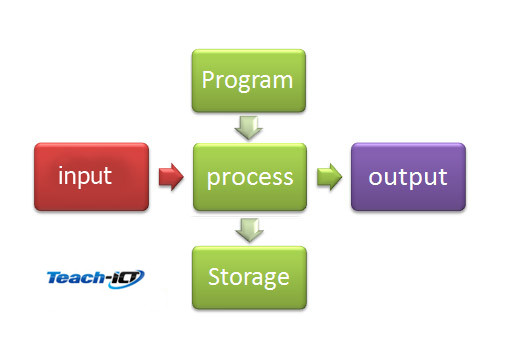

##### Checklist
- [ ] Architecture
- [ ] Memory
- [ ] Storage
- [ ] Wi-fi and wired Networks
- [ ] Networks
- [ ] Network Security
- [ ] Systems Software
- [ ] Ethical and Legal
- [ ] Algorithms
- [ ] Programming techniques
- [ ] Producing robust programs
- [ ] Computational logic
- [ ] Translators and facilities of languages
- [ ] Data representation

# Computing
## Architecture
### Computer System
A **Computer System** takes a set of digital inputs, processes them and creates a set of outputs. This is done by a combination of **hardware** and **software**.

- The Computer recieves inputs via an **input device** (e.g. keyboard, mouse...)

The processing of inputs occurs in the CPU (Central Processing Unit):
  - a single electronic chip within computer system.
  - microprocessor (_"brain"_)

The CPU uses a computer program which has instructions on how to process the inputs. **Software** is a computer program that contains the set of instructions needed by the CPU in order to perform a specific task.
## memory
## Storage
## Wi-fi and wired networks
## Networks
## Network Security
## Systems Software
## Ethical and Legal
## Algorithms
## Programming techniques
## Producing robust programs
## Computational logic
## Translators and facilities of languages
## Data Representation
